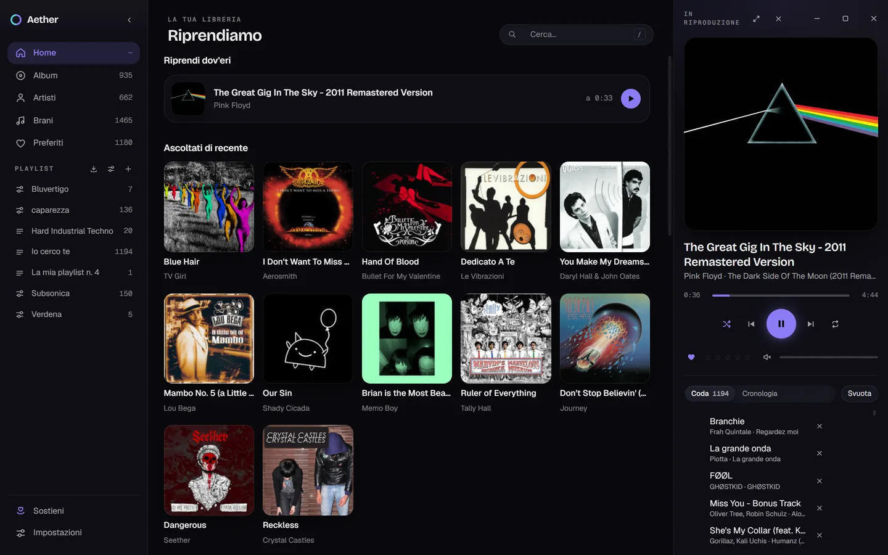
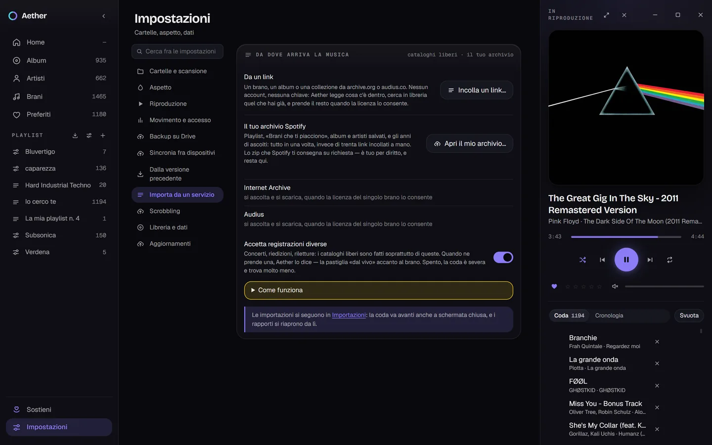
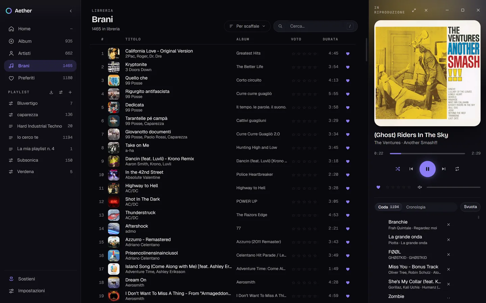
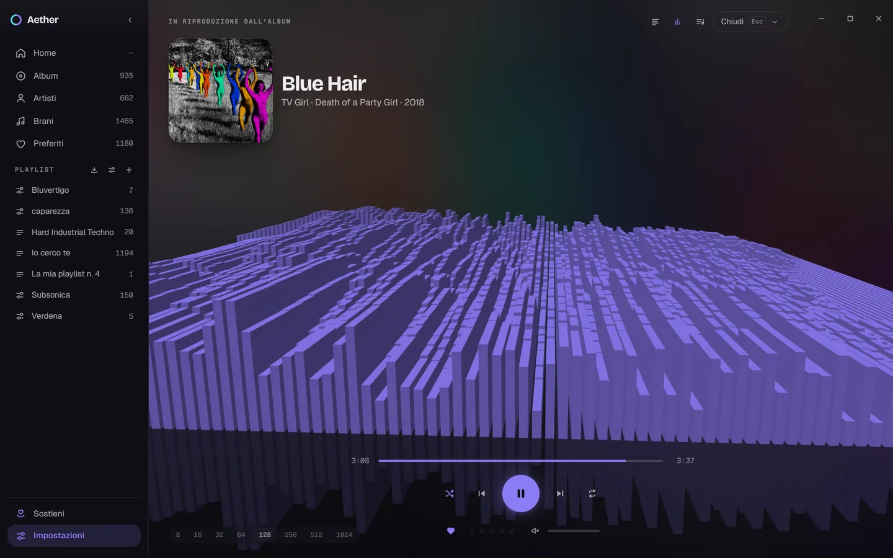
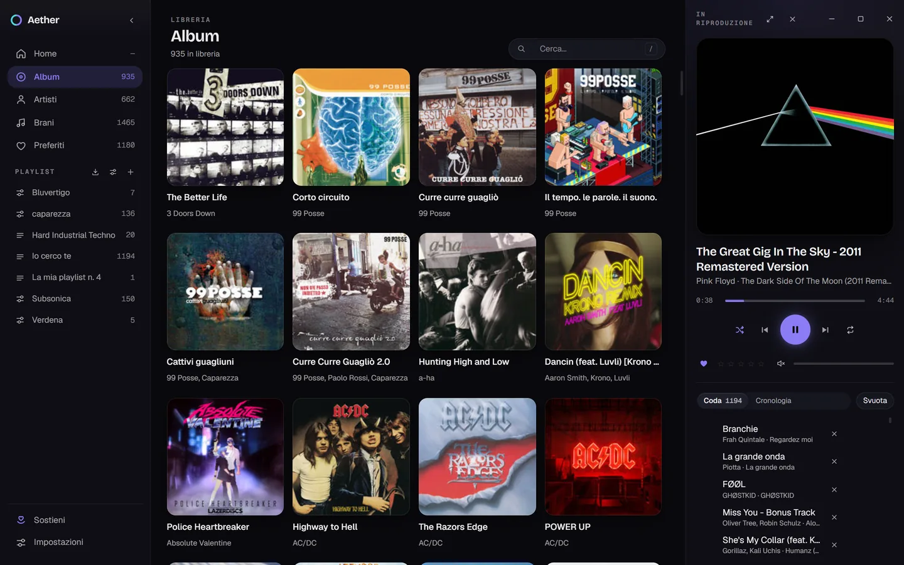
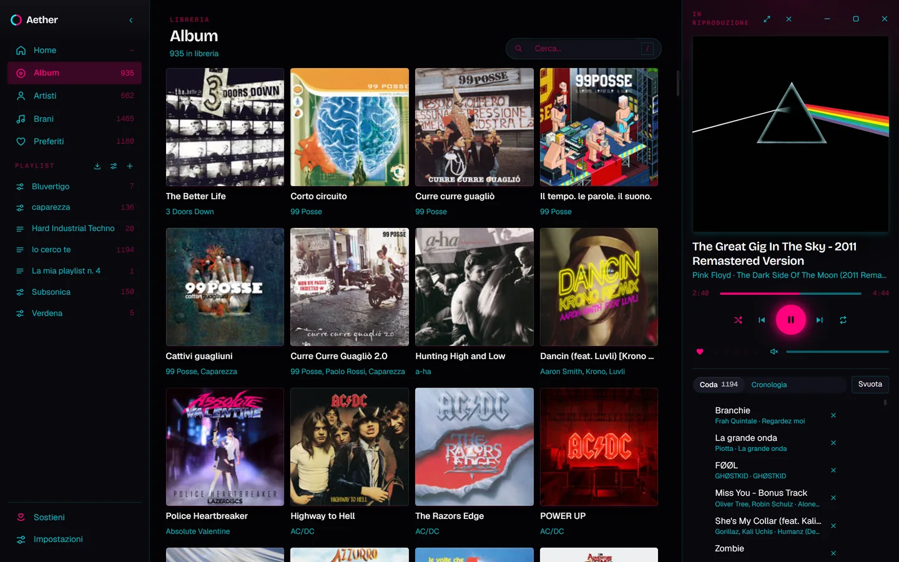
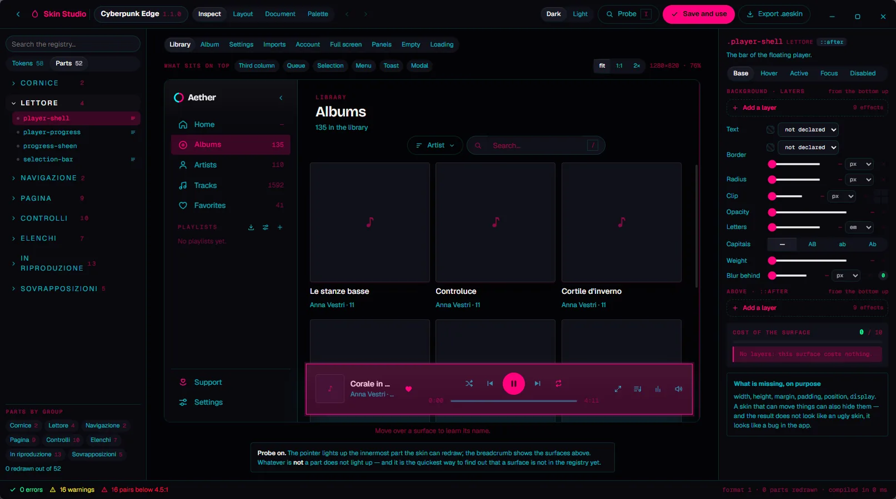

# Aether

A music player for Windows, written in Rust. It plays the audio files on your
disk and joins your local library up with the freely accessible music catalogs.

> **Project status:** under development. It builds and runs on Windows. The
> executable is not digitally signed, and the macOS, Linux and mobile versions
> do not exist. See [Known limits and planned
> work](#known-limits-and-planned-work).

## Contents

- [Overview](#overview)
- [Where the music comes from](#where-the-music-comes-from)
- [Sources that are excluded](#sources-that-are-excluded)
- [Features](#features)
- [Interface](#interface)
- [Customization](#customization)
- [Installation](#installation)
- [Building](#building)
- [Architecture](#architecture)
- [Licenses](#licenses)
- [Privacy](#privacy)
- [Keeping the project going](#keeping-the-project-going)
- [Known limits and planned work](#known-limits-and-planned-work)
- [Related documents](#related-documents)

---

## Overview

Aether plays the audio files already on your disk. Starting from a playlist —
exported from your Spotify archive, read from an M3U file, or given as a link —
it matches the tracks against your local library and fetches the missing ones
from the freely accessible catalogs: Internet Archive and Audius. Every track it
acquires keeps the license of the source it came from. Tracks that no free
catalog has end up in a shopping list, with links to the shops that pay the
artists.

The program does not download content from YouTube, does not scrape Spotify and
does not ship third-party binaries. The reasons are documented in [Sources that
are excluded](#sources-that-are-excluded) and are a project constraint, not a
temporary limitation.



The home screen. The «Pick up where you left off» panel restores the last
interrupted track and the exact position inside it. Below are the recently
played tracks, the most recently added albums, and the records that have been in
the library a long time and never played.

*The images in this document come from a real library of 1465 tracks and 935
albums.*

---

## Where the music comes from

| Source | Content | Local copy |
| --- | --- | --- |
| **Local files** | The main library. Scanning of the folders you point at. | Already yours |
| **Internet Archive** | Live Music Archive (over 250,000 concerts by artists who authorized the recording), netlabels, public domain | Yes, when the item's license allows it |
| **Audius** | Tracks published by artists under an open license | Yes, when the artist has enabled downloading **and** the license allows it |
| **Spotify GDPR archive** | Playlists, saved tracks and albums, followed artists, complete listening history | Metadata, not audio |
| **Playlist files** | M3U, M3U8, PLS | The path, not the file |
| **MusicBrainz + Cover Art Archive** | Tags and cover art | Free metadata |

On Audius, permission is set by the artist per individual track. There are three
distinct controls: the download switch and two *gates*, which can make access
conditional on following the artist or on holding a token. Aether checks all
three and considers permission granted only in the absence of any prohibition.

**Jamendo** is implemented and covered by tests, but disabled in this version.
The cause isn't technical: the API is free for non-commercial use only, and the
terms define commercial use as «any monetary compensation». The module is
already set up for streaming-only listening — the terms forbid caching and
offline access — through `aether-net::FlussoHttp`, which plays a track without
writing it to disk. See [Known limits](#known-limits-and-planned-work).



The same sources in the program's interface. The «From a link» field accepts
archive.org and audius.co addresses without requiring accounts or API keys.
«Your Spotify archive» processes locally the ZIP archive Spotify hands you on
request.

### What it doesn't cover

No freely accessible source distributes the commercial catalog. This is not a
technical limitation to be worked around: it is the reason other programs carry
out operations the terms of the services they use do not permit. Aether covers
what it can through lawful channels and, for the rest of the catalog, points at
where to buy it. Anyone looking for a tool to obtain commercial discographies
for free will not find that feature in Aether.

---

## Sources that are excluded

### YouTube

The *YouTube API Developer Policies* forbid downloading and storing audiovisual
content (§ III.E.1.a: «You must not… download, import, backup, cache, or store
copies of YouTube audiovisual content without YouTube's prior written
approval»). There is no configuration that would make the operation compliant.

The same policies also forbid separating the audio from the video (§ III.I.7),
playback from a player that isn't visible (§ III.I.9) and retaining metadata for
more than thirty days (§ III.E.4). A music player that keeps a persistent
library is incompatible with all three clauses. The source is therefore excluded
entirely, and not in a reduced form.

### Unauthorized access to Spotify

Using Spotify's private endpoints, reconstructed tokens or the web player's
client id constitutes unauthorized access to the service and is excluded.

What remains available is the GDPR archive, which Spotify is required to hand to
the user on request under art. 20 of EU Regulation 2016/679, and which contains
a longer listening history than the public API offers.

---

## Features

- **Gapless playback** with ReplayGain, an equalizer and a persistent queue. A
  single audio engine (`cpal` + `symphonia`) spread over three threads, with no
  shared lock at all between the decoder and the audio callback.
- **A library on SQLite**: incremental scanning with detection of moved files,
  manual and automatic playlists, ratings, favorites and listening history. A
  track can leave it too: «Remove from library» takes the row out and leaves
  the file where it is, «Delete from disk» sends the file to the Recycle Bin,
  and both ask first. A correction you made by hand now survives its track
  disappearing and coming back — an unplugged external disk, a watched folder
  removed and added again.
- **Metadata enrichment** from MusicBrainz, written **into the library and
  never into your files**. The search is carried out on the complete album
  rather than on the individual track; in the absence of matches that are
  reliable enough, nothing is written at all. What it works out is annotated in
  a table of its own, so a correction you made by hand always wins over it and
  forgetting the whole thing is one button — see
  [`PRIVACY.md`](PRIVACY.md) § 8. Tags an older version already wrote into your
  files are left alone rather than reverted on your behalf; the way back is a
  separate button of its own, labelled with the fact that it writes into the
  files, and it is kept for one release and then removed.
- **A folder panel** that reads the tree out of the library instead of the
  disk, so it opens instantly and never touches a network share.
- **Synced lyrics** from LRCLIB, with no key and no account, and a way to time
  them yourself when nobody has: you tap once per line, and then — optionally —
  once per word, which writes an `.a2.lrc` beside the ordinary `.lrc` that
  every other player can still read. A constant drift is corrected with two
  buttons that are **always** reachable, not only when the fit is judged poor:
  a text that sits inside the right duration can still be half a second early.
  When the catalogue holds more than one answer, «Other lyrics» lists them all
  with their first lines, and what you choose stays chosen — «none of these»
  included, which is remembered rather than asked again.
- **Affinity**: what plays after a record ends is chosen from three independent
  layers — the sound of your files, analyzed locally; what you have listened to;
  and the cultural proximity read from ListenBrainz. Each missing layer removes
  itself without breaking the others, and underneath everything the old rule
  cascade remains as a floor. The queue says which layer chose each track.
- **Monday**: up to four collections of twenty tracks, computed locally while
  the machine is idle, which stay put for seven days and then become other ones.
  What came out last week does not come out again.
- **Skins** with a built-in visual editor (the Studio) and a packaged
  distribution format. Inside the Studio, a side chat can ask a language model
  to make the change for you — a model running on your own machine (Ollama, or
  LM Studio's local server, the one the Bionic app sits on) or a remote one
  through OpenRouter. It is off until you configure a provider, and what it
  sends is documented in [`PRIVACY.md`](PRIVACY.md) § 2-quater.
- **Backup and synchronization** to Google Drive or to a shared folder, plus a
  **profile** you can carry by hand: a `.aeprofile` archive with the settings,
  the library, the listening history, the lyrics, your corrections, the covers
  and the skin packages in it. It is written and read straight onto the disk,
  one entry at a time, so a profile of several hundred megabytes never sits in
  memory; importing shows you the plan first and proposes a remapping for every
  root that does not exist on this machine. The old seventeen-line JSON is
  still read, and no longer written.
- **Scrobbling** to Last.fm and ListenBrainz.
- **Automatic updates**: a check for releases on GitHub every thirty minutes,
  with a notification. Installing always requires an explicit confirmation, and
  the installer's signature is verified before it runs. The feature can be
  switched off in the settings; the traffic it generates is documented in
  [`PRIVACY.md`](PRIVACY.md) § 6.

---

## Interface

On first run a guided tour runs once, in ten steps. It is not a carousel of
pictures: each step finds the real element in the window, cuts a hole in the
veil over it and puts the bubble beside it, so what you are shown is the
program at the size and in the skin you are running it in. A step whose anchor
is not on screen — the queue is closed, nothing is playing — is skipped rather
than faked. *Settings → Redo the tour* brings it back.



The track list, with cover art, album, rating and duration. Loading is
progressive: further pages are requested automatically as the end of the list
approaches, with no numbered pagination.



The playback screen with the spectrum analyzer on. The samples are taken after
the equalizer and before the volume control: changes to the equalization curve
are visible in the bars, changes to the volume are not. The bands reach the
interface through a ring buffer that discards excess samples when it is full, so
as not to introduce any wait in the audio callback. Under the rating there is a
line saying what the file is — «FLAC · 44.1 kHz · Stereo · 1058 kbps» — read
from four columns that had been in the database since the first version and
that nothing had ever read back. It describes the **file** and not the output:
if the sound card is resampling, this line still says what the edition is.

The whole window zooms, `Ctrl++`, `Ctrl+-` and `Ctrl+0`, over the same seven
steps between 90% and 200% that every browser offers. It is the WebView's zoom
and not a scale in the stylesheet, so the two places that measure the DOM — the
virtualized list and the tour's spotlight — go on working in CSS pixels and
never notice. The step is remembered; it does not travel in a profile, because
it is the correction left over after Windows' own scaling on this monitor.

---

## Customization

| «Plain» skin, the default | «Cyberpunk Edge» skin, installed |
| --- | --- |
|  |  |

The same screen with two different skins. A skin redefines colors, borders,
shadows, type weights and corner radii across 51 interface components — and,
since 2.3.0, the visualizer's scene as well: not only its colors, but its
geometry and its behavior, from the depth of the room and the aperture of the
lens down to how fast a bar falls. This is not a matter of switching between a
light theme and a dark one.

Since 2.3.1 a skin also declares **named animations** — up to eight of them,
two to six frames each, bound to a part's `enter`, `hover`, `active`, `focus`
or `disabled` state — and the Studio has a Motion panel for them, with the
curves, the page transition and a cost budget. The line that decides what
belongs there is that a skin animates **states of the DOM, not events of the
application**. `iterations: infinite` is refused without exception, because the
rules that stop an endless animation under «reduced motion» are written by
hand, one at a time, and a skin cannot write them: a skin's endless animation
would be the only thing in Aether nobody could stop. Every duration the
compiler emits passes through `calc(… * var(--motion-scale))`, and a test
asserts that none escapes.



The Studio is the built-in editor. On the left, the tree of components and of
the 73 tokens; in the middle, the preview updated in real time, which works on a
sample library and not on yours; on the right, the inspector of the selected
component, with its states and its layers. The probe lights up whatever sits
under the pointer, so that a surface can be found without knowing its name.

The bottom bar reports errors, warnings, redrawn components and the number of
color pairs with a contrast ratio below 4.5:1, the recommended legibility
threshold. The figure is computed before export, so that a skin distributed with
contrast warnings is the result of a deliberate choice.

### Asking instead of writing

The Studio also has a chat, and it works because of three properties the skin
format already had: the vocabulary is **closed and declared** — 73 tokens, 51
components, 11 effects, each with a valid example produced by the real parser —
the source of truth is **text**, edited by path; and validation **never fails**,
answering instead with positioned errors and a «did you mean» for every
misspelled name. Those three are exactly what a language model needs to work on
a document and to correct itself when it gets a name wrong.

There are two modes, switched in the panel's header. In *Proposal*, the model
proposes, you read the diff, and you press Apply. In *Agent*, the model applies,
re-reads the validation of the result, and fixes what it broke — at most four
rounds, with a Stop button. Either way the change goes through the same path a
dragged slider does, so Ctrl+Z takes it back; in Agent mode a snapshot is taken
before the first round.

You configure the model in Settings › AI Models. Several named profiles can
coexist; each key lives in the operating system's keychain, never in the library
database, and never passes through the window.

---

## Installation

The Windows installer is available among the assets of the [latest
release](https://github.com/FedericoBaratti/Aether/releases/latest): an NSIS
executable.

**Windows SmartScreen warning.** The executable is not signed with a code
signing certificate, so SmartScreen blocks it on first launch. To proceed: «More
info» → «Run anyway». The reasons for the missing signature are given in [Known
limits](#known-limits-and-planned-work).

The changes introduced by each version are listed in
[`CHANGELOG.md`](CHANGELOG.md). The numbering rule is described at the top of
that file, and 2.3.1 amended it: the number no longer tries to say how much a
release contains, because that turned out to be a thing two readers score
differently. What it does say is whether a copy that updated and a copy that
did not still understand each other.

Migrations are not reversible, and that warning moved out of the number and
into the text. **Every release that migrates the database names its migrations
in its own entry and says what going back would cost** — which is always the
same thing: a copy of the database taken before the update, because an older
version refuses to open a newer database rather than guessing at it. 2.3.1
migrates twice, `019_identita_e_metadati.sql` and `020_cronologia_unica.sql`,
and it is a patch.

---

## Building

### Requirements

- **Rust** — the version given in `rust-toolchain.toml`
- **Node.js** 20 or later
- **Windows** — the only platform the installer supports

### Commands

```bash
# The test suite: about 1900 tests, runnable with no network connection
cargo test --workspace
```

```bash
# Start in development mode
cd apps/desktop
npm install
npm run dev
```

```bash
# Build the NSIS installer
cd apps/desktop
npm run build
```

```bash
# Regenerate the third-party license notices
node strumenti/licenze.js
```

### Updater signing keys

The update system requires a key pair, generated once. The keys are not
versioned: the `.chiavi/` folder is excluded through `.gitignore`.

```bash
cd apps/desktop
npm run tauri signer generate -- -w ../../.chiavi/aether.key
```

The contents of the `.pub` file go into `plugins.updater.pubkey` inside
`tauri.conf.json`; the private key goes into the repository secrets under the
name `TAURI_SIGNING_PRIVATE_KEY`.

The private key signs the executables that get installed automatically on users'
systems: losing it permanently prevents every existing installation from
updating. The `strumenti/manifesto.js` script compares the identifiers of the
two halves on every release, so that any mismatch surfaces in CI.

---

## Architecture

```
core/
  aether-domain     pure logic: no I/O, no access to the clock,
                    no global state
  aether-play       audio engine (cpal + symphonia)
  aether-app        the library: SQLite, scanning, imports, queue
  aether-catalogo   the free-access catalogs; the only module that
                    downloads audio
  aether-net        blocking HTTP (ureq), rate limiting, circuit breaker
  aether-meta       MusicBrainz, Cover Art Archive, Deezer, iTunes
  aether-archivio   reading the Spotify GDPR archive
  aether-skin       the skin format and its compiler
  aether-oauth      PKCE and the system keychain
  aether-cloud      Google Drive
  aether-sync       synchronization between devices
  aether-scrobble   Last.fm and ListenBrainz
  aether-ia         an OpenAI-compatible client for language models,
                    which knows nothing about skins
apps/desktop        the interface: Tauri 2 + React 19
```

The direction of the dependencies is binding. `aether-catalogo` has no access to
`rusqlite`: it is therefore structurally impossible, and not merely inadvisable,
to hold the library lock for the whole duration of a download.

---

## Licenses

Aether's code is distributed under the **MIT** license
([`LICENSE`](LICENSE)).

The dependencies use different licenses: the `symphonia` family is **MPL-2.0**,
`cpal` is **Apache-2.0**. The complete list with the full texts is in
[`THIRD-PARTY-NOTICES.md`](THIRD-PARTY-NOTICES.md), regenerable with the script
given in [Building](#building). The Geist and Bricolage Grotesque fonts are
distributed under **SIL OFL 1.1** (`apps/desktop/src/font/OFL.txt`).

The music acquired through Aether is subject to the license of the source it
came from, which is distinct from the program's. The implications are described
in [`TERMS.md`](TERMS.md), including the Live Music Archive's **non-commercial**
clause, which binds the listener too.

---

## Privacy

Aether collects no telemetry, requires no account and talks to no servers other
than the ones the user explicitly queries: the music catalogs, MusicBrainz,
Google Drive, the scrobbling service, and the language model configured for the
Skin Studio — the last three only if you connect them, and the last one possibly
not a server at all, since Ollama and LM Studio run on your own machine.

[`PRIVACY.md`](PRIVACY.md) lists every single network request the program can
make and the data each one transmits.

---

## Keeping the project going

Aether is free and funded by donations. There is no paid version and none is
planned: two of the integrated sources, the Live Music Archive and Jamendo, are
subject to *non commercial* clauses that a paid version would violate. The
constraint is stated explicitly in the terms of use.

---

## Known limits and planned work

- **Code signing for Windows.** Without a certificate, SmartScreen blocks the
  installer, which is the main reason independent applications fail to get
  installed. An OV certificate requires validation of the applicant's identity
  and an annual cost.
- **Jamendo.** The code is there and the tests pass
  (`cargo test -p aether-catalogo --features jamendo`), but the feature is
  disabled pending formal clarification from `licensing@jamendo.com` on whether
  donations count as commercial use.
- **Streaming-only tracks.** Since 2.2.0 a track whose path is a catalog address
  does play: `FlussoHttp` reads it from the network with positional access, and
  what reaches the audio engine is indistinguishable from a file. What is still
  missing is a place of its own in the library — `tracks.path` is `NOT NULL
  UNIQUE`, so a track that is not a file has to borrow the column meant for one
  — and the «Explore» section from which to search for such tracks. Closing the
  gap takes a migration, which since 2.3.1 no longer implies a minor version but
  does imply a line in that release's entry saying what going back would cost.
- **macOS and Linux.** The installer's only target is NSIS: the supported
  platform is therefore Windows.
- **Mobile application.** Present in the previous version of the project, not
  yet rewritten.

Two questions require a written clarification before publication: whether
**donations** constitute commercial use for the purposes of Jamendo's terms
(`licensing@jamendo.com`) and of the Deezer API used for metadata. Failing a
reply, the Jamendo module stays behind a Cargo feature that can be switched off.

---

## Related documents

| Document | Content |
| --- | --- |
| [`CHANGELOG.md`](CHANGELOG.md) | The changes in each version and the numbering rule |
| [`PRIVACY.md`](PRIVACY.md) | How data is handled and every network request |
| [`TERMS.md`](TERMS.md) | Terms of use and the licenses of acquired content |
| [`SECURITY.md`](SECURITY.md) | How to report a vulnerability |
| [`THIRD-PARTY-NOTICES.md`](THIRD-PARTY-NOTICES.md) | The dependencies' licenses |
